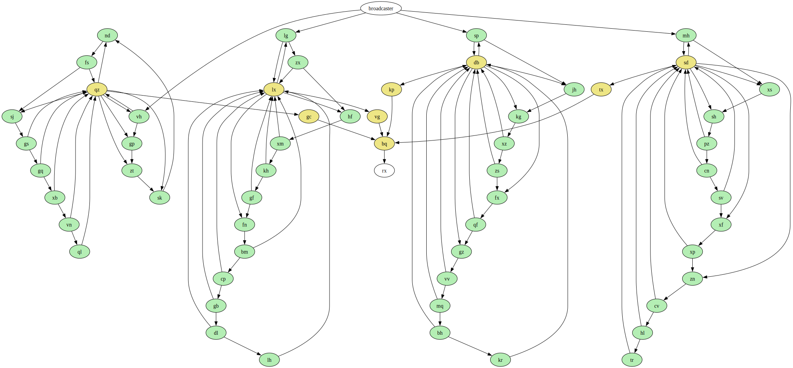

# Advent of Code Day 20 - Pulse Propagation

## Part 1

Our input is a graph. The graph starts with a button (not shown) which connects to a `broadcaster`.
The `broadcaster` connects to `modules`, which connect to other `modules`, which connect to... and so on.

Here's one of the provided example graphs:

```
broadcaster -> a
%a -> inv, con
&inv -> b
%b -> con
&con -> output
```

This produces a graph that looks like:


There are `flip-flop` modules (`a` and `b`, prefixed `%`) and `conjunction` modules (`inv` and `con`, prefixed `&`).

`Flip-flop` modules all start `OFF`, but can switch to `ON` when sent a `LOW pulse`. These modules emit
a `HIGH pulse` when turned `ON` and a `LOW pulse` when turned `OFF`.

`Conjunction` modules remember the last signal sent to them for each `module` that flows into them. When processing a
`conjunction` module, they emit a `LOW pulse` when all inputs are `HIGH pulses` and a `HIGH pulse` otherwise.

Here's what my actual input looks like (following the same color scheme from above):



For Part 1, we need to find the product of `LOW / HIGH pulses` seen in the graph for `1,000` broadcasts.

### Approach

`1,000` broadcasts can be easily simulated brute force.

#### Build the graph

I do the following:

- Connect `modules` to one another (in the `moduleGraph`)
- Set all `conjunction` modules to remember `LOW pulses` (in the `conjunctionModules`)
- Set all `flip-flop` modules to `OFF` (in the `flipFlopStates`)

```kotlin
// All module labels to their children labels.
val moduleGraph: MutableMap<String, List<String>> = mutableMapOf()

// Conjunction modules have to remember pulses from their parents.
val conjunctionModules: MutableMap<String, MutableMap<String, Pulse>> = mutableMapOf()

// Flip-flop states.
val flipFlopStates: MutableMap<String, State> = mutableMapOf()

// Create links from each module to their children.
moduleConfig.forEach { line ->
    val (source, destinations) = line.split(" -> ")
    val children = destinations.split(", ")

    if (source == "broadcaster") {
        moduleGraph[source] = children
    } else {
        // We have either a conjunction or flip-flop module.
        val type = source[0]
        val sourceLabel = source.substring(1)

        if (type == '&') {
            conjunctionModules[sourceLabel] = mutableMapOf()
        } else {
            flipFlopStates[sourceLabel] = State.OFF
        }
        moduleGraph[sourceLabel] = children
    }
}

// Re-process the input, associating conjunction modules to their parents.
moduleConfig.forEach { line ->
    val (source, destinations) = line.split(" -> ")
    val children = destinations.split(", ")

    children.forEach { child ->
        if (conjunctionModules.containsKey(child)) {
            // Substring is fine here; broadcaster is only linked to flip-flops.
            conjunctionModules[child]!![source.substring(1)] = Pulse.LOW
        }
    }
}
```

### Run the simulation

I keep track of counters for each type of pulse we care about:

```kotlin
// Keep track of LOW / HIGH pulses.
var highPulses = 0L
var lowPulses = 0L
```

I then run a loop `1,000` times, following the pre-defined `module` rules and increment each time we broadcast a
new `pulse`:

```kotlin
(1..1000).forEach { _ ->
    // Start by pushing the button (send a LOW to broadcaster)
    lowPulses++
    val toProcess: MutableList<Pair<Pulse, String>> = mutableListOf(Pair(Pulse.LOW, "broadcaster"))
    while (toProcess.isNotEmpty()) {
        val nextBatch: MutableList<Pair<Pulse, String>> = mutableListOf()
        toProcess.forEach { (pulse, source) ->
            val children = moduleGraph[source]
            if (source == "broadcaster") {
                // broadcaster just propagates to children
                children!!.forEach { child -> nextBatch.add(Pair(pulse, child)) }
            } else if (children != null) {
                // The source is either a conjunction or a flip-flop.
                if (conjunctionModules.containsKey(source)) {
                    // Conjunction modules propagate LOW if all parents were HIGH.
                    val propagatedPulse =
                        if (conjunctionModules[source]!!.values.all { it == Pulse.HIGH }) {
                            Pulse.LOW
                        } else {
                            Pulse.HIGH
                        }
                    children.forEach { child ->
                        // We could be propagating to another conjunction.
                        if (conjunctionModules.containsKey(child)) {
                            conjunctionModules[child]!![source] = propagatedPulse
                        }
                        nextBatch.add(Pair(propagatedPulse, child))
                    }
                } else {
                    // Flip-flops only change state when they receive a low pulse.
                    if (pulse == Pulse.LOW) {
                        if (flipFlopStates[source] == State.ON) {
                            // The flip-flop is turning off and sending a LOW.
                            flipFlopStates[source] = State.OFF
                            children.forEach { child ->
                                if (conjunctionModules.containsKey(child)) {
                                    conjunctionModules[child]!![source] = Pulse.LOW
                                }
                                nextBatch.add(Pair(Pulse.LOW, child))
                            }
                        } else {
                            // The flip-flop is turning on and sending a high.
                            flipFlopStates[source] = State.ON
                            children.forEach { child ->
                                if (conjunctionModules.containsKey(child)) {
                                    conjunctionModules[child]!![source] = Pulse.HIGH
                                }
                                nextBatch.add(Pair(Pulse.HIGH, child))
                            }
                        }
                    }
                }
            }
        }

        // Increment pulse counts and go again.
        lowPulses += nextBatch.count { it.first == Pulse.LOW }
        highPulses += nextBatch.count { it.first == Pulse.HIGH }
        toProcess.clear()
        toProcess.addAll(nextBatch)
    }
}
```

Finally, we return our answer:

```kotlin
return lowPulses * highPulses
```

## Part 2

There is a single `flip-flop` labeled `rx`. We are interested in how many button presses it takes for `rx` to see
a `LOW` signal.

Modifying part 1 to run until we meet that condition did not work (I let it run for `100 billion` button presses before
moving on).

### Analysis

Let's take a look at the end of our graph:


Here, we see a collection of `conjunction` modules. We can work backwards to infer what it takes to send a `LOW pulse`
to `rx`:

- To send a `LOW pulse` to `rx`, `bq` must see a `HIGH pulse` from each `gc`, `vg`, `kp`, and `tx`.
- In order for `gc` to send a `HIGH pulse`, `qz` must send a `LOW pulse`. This is also true for `lx -> vg`, `db -> kp`,
  and `sd -> tx`.

Therefore, in order for `rx` to see a `LOW pulse`, `qz`, `lx`, `db`, and `sd` must all send a `LOW pulse` in the <b>
same</b> button press.

If we re-purpose our solution from `part 1` and isolate `qz`, we can try to identify what happens when we broadcast a
large number of times.

Instead of running the simulation forever, we can run it until we see each node related to `qz` twice:

```kotlin
val interestingConjunctionModules = listOf("qz")
val interestingPointsStart: MutableMap<String, Int> =
    interestingConjunctionModules.flatMap { conjunctionModules[it]!!.keys }.associateWith { -1 }
        .toMutableMap()
val interestingPointsRepeat: MutableMap<String, Int> =
    interestingConjunctionModules.flatMap { conjunctionModules[it]!!.keys }.associateWith { -1 }
        .toMutableMap()

val repeatsNotFound: MutableSet<String> = mutableSetOf()
repeatsNotFound.addAll(interestingPointsRepeat.keys)
```

Then, as we process `pulses`, do a check for nodes feeding into `qz`:

```kotlin
if (interestingPointsStart.containsKey(source) && pulse == Pulse.LOW) {
    // Low pulses change the state of flip-flops.
    if (flipFlopStates[source]!! == State.OFF) {
        // If the flip-flop is off, it will become on, sending a high pulse.
        // If a conjunction module gets all highs, it sends a low. We are interested in this case.
        if (interestingPointsStart[source]!! == -1) {
            // We've never seen this start point before.
            interestingPointsStart[source] = pressNum
        } else if (interestingPointsRepeat[source]!! == -1) {
            // Otherwise, we've repeated this node.
            interestingPointsRepeat[source] = pressNum - interestingPointsStart[source]!!
            repeatsNotFound.remove(source)
        }
    }
}
```

Investigating the contents of `interestingPointsStart` and `interestingPointsRepeat`, we see:

```kotlin
vh: 1, 2
fs: 32, 64
gs: 128, 256
gq: 256, 512
xb: 512, 1024
vn: 1024, 2048
ql: 2048, 4001
```

Each `module` that feeds into `qz` repeats the `pulse` it sends to `qz` with a regular cadence:

- `vh` sends on every other button press, starting at button press `1` (`1`, `3`, `5`, etc.)
- `fs` sends a pulse every 64 button presses, starting at button press `32`
- etc. etc. etc.

The result we care about is `ql`, which, starting at the `2048th` button press, sends a `pulse` every `4001` button
presses.

We care about `ql` as, in order for `qz` to broadcast a `LOW pulse`, it must remember a `HIGH pulse` for each input that
feeds into it. In order for `ql` to turn `ON` and send a `HIGH pulse`, each `module` in its chain must have already sent
a `HIGH pulse` to `qz`.

Knowing this, we can look at all interesting points for `qz`, `lx`, `db`, and `sd`:

```kotlin
val interestingConjunctionModules = listOf("qz", "lx", "db", "sd")
...
vh: 1, 2
lg: 1, 2
sp: 1, 2
mh: 1, 2
zx: 2, 4
xm: 8, 16
xz: 8, 16
pz: 8, 16
kh: 16, 32
zs: 16, 32
cn: 16, 32
fs: 32, 64
gf: 32, 64
sv: 32, 64
qf: 64, 128
gs: 128, 256
bm: 128, 256
xp: 128, 256
gq: 256, 512
cp: 256, 512
vv: 256, 512
xb: 512, 1024
gb: 512, 1024
mq: 512, 1024
cv: 512, 1024
vn: 1024, 2048
dl: 1024, 2048
bh: 1024, 2048
hl: 1024, 2048
ql: 2048, 4001
lh: 2048, 4027
kr: 2048, 3929
tr: 2048, 3769
```

We see that `ql`, `lh`, `kr`, and `tr` all take the longest to repeat themselves in their respective chains. Once all of
these `modules` turn on in the same button press, we have our answer.

We can calculate that with using LCM:

```kotlin
return lcm(listOf("ql", "lh", "kr", "tr").map { interestingPointsRepeat[it]!!.toLong() })
```